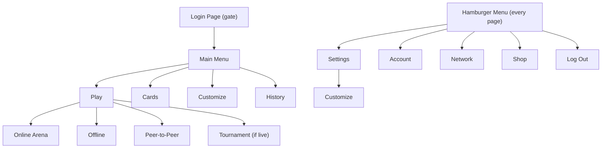

# UI Flow

This document tracks the complete menu and navigation structure of the game. Use it as the source of truth when adding new screens or changing navigation paths.

Last updated: 2026-03-19

## Navigation Flowchart

## Login Page

**Route:** None (rendered by `AuthGate` when `isLoggedIn` is false)

**Purpose:** Blocks access to the entire app until the user selects a funded account and logs in.

**Behavior:**
- Auto-connects to the configured blockchain endpoint on mount.
- If the user was previously logged in (address stored in `localStorage` under `oab-logged-in`), the session is restored automatically after connection and this page is skipped.
- Logging out (via hamburger menu) clears the stored session and returns here.

**Contents:**
- Game title and subtitle
- Connection status banner (connected / connecting / disconnected)
  - "Configure" link to expand network picker when disconnected
- Network picker (collapsed by default): Localhost / Hosted Node / Custom endpoint + Connect button
- **Account selector** dropdown (shown when connected) — lists injected wallet accounts, local accounts, and dev accounts
- **Balance display** — shows the selected account's free balance
  - If balance > 0: **Log In** button (gold gradient)
  - If balance = 0: **Fund Account** button (purple gradient, replaces Log In)
  - If balance is loading: button is hidden
- "or" divider
- **Create Game Account** button — generates a new local mnemonic account, funds it, and auto-selects it

## Main Menu

**Route:** `/`

**Component:** `HomePage`

**Purpose:** Central hub. Four main buttons lead to the primary sections of the game.

**Contents:**

| Label | Route | Color | Description |
|---|---|---|---|
| Play | `/play` | Amber/gold | Online Arena, Offline, Peer-to-Peer |
| Cards | `/cards` | Violet | Browse sets & collection |
| Customize | `/customize` | Emerald | Card art, backgrounds & avatars |
| History | `/history` | Blue | Achievements, replays & stats |

- Version number (`v0.1.0`) at the bottom
- Particle background animation
- Rotate prompt overlay (mobile portrait)

## Play

**Route:** `/play`

**Back:** Menu (`/`)

**Component:** `PlayPage`

**Purpose:** Choose a play mode.

**Contents:**

| Label | Route | Size | Notes |
|---|---|---|---|
| Online Arena | `/blockchain` | Large (primary) | Compete on the blockchain. Shows connection status dot + block number when connected. Routes to `/network` if not connected. |
| Tournament | `/tournament` | Medium | Only shown when an active tournament exists. Shows entry fee and prize pool. |
| Offline | `/local` | Half-width | Single player, no transactions. Routes to `/network` if not connected. |
| Peer-to-Peer | `/multiplayer` | Half-width | Direct connect P2P multiplayer. |

Online Arena is intentionally the largest button — this is the primary game mode.

## Cards

**Route:** `/cards`

**Back:** Menu (`/`)

**Status:** Placeholder page. Will contain: browse card sets, view collection, create custom packs.

## Customize

**Route:** `/customize`

**Back:** Menu (`/`)

**Purpose:** Visual customization — card art, backgrounds, avatars, card borders.

## History

**Route:** `/history`

**Back:** Menu (`/`)

**Status:** Placeholder page. Will contain: achievements, replays, stats, hall of fame.

## Hamburger Menu (Global)

**Position:** Fixed top-right corner, present on every page after login.

**Trigger:** Hamburger icon button. Opens a slide-out panel from the right with a dark backdrop.

**Close:** Click backdrop, click X button, or press Escape.

**Menu items:**

| Label | Icon | Route | Notes |
|---|---|---|---|
| Settings | Gear | `/settings` | Game settings hub |
| Account | Person | `/account` | Account info, balances, name editing |
| Network | Globe | `/network` | Blockchain endpoint picker |
| Shop | Cart | `/shop` | Placeholder — coming soon |
| Log Out | Exit arrow | — | Clears login session, returns to login page |

The Log Out button sits at the bottom of the panel, separated by a border. It shows "connected" text when the blockchain connection is active.

## Settings

**Route:** `/settings`

**Back:** Menu (`/`)

**Contents:**
- Link to **Customize** (`/customize`) — card art, backgrounds, avatars

## Account

**Route:** `/account`

**Back:** Menu (`/`)

**Purpose:** View and manage the currently logged-in account.

**Contents:**
- **Name** — display name with inline edit (Save/Cancel, Enter/Escape). Persists to `localStorage` for local accounts.
- **Address** — full SS58 address, source type (dev / local / injected)
- **On-chain info** — 2x2 grid:
  - Nonce
  - Free balance (green)
  - Reserved balance (yellow)
  - Frozen balance (blue)
- Refresh button

## Network

**Route:** `/network`

**Back:** Menu (`/`)

**Purpose:** Configure and connect to a blockchain node.

**Contents:**
- **WebSocket Endpoint** selector — radio-style buttons:
  - Localhost (`ws://127.0.0.1:9944`)
  - Hosted Node (`wss://oab-rpc.shawntabrizi.com`)
  - Custom (freeform URL input)
- **Connect / Reconnect** button
- **Connection status** — dot indicator, connected/disconnected label, block number, current endpoint URL, error message if any

## Shop

**Route:** `/shop`

**Back:** Menu (`/`)

**Status:** Placeholder page. Shows a cart icon, "Coming Soon" heading, and description text.
