# UI Flow

This document tracks the complete menu and navigation structure of the game. Use it as the source of truth when adding new screens or changing navigation paths.

Last updated: 2026-03-19

## Navigation Flowchart

```mermaid
flowchart TD
  Login["Login Page (gate)"]
  Login --> Main["Main Menu /"]

  Main --> Play["/play"]
  Main --> Cards["/cards"]
  Main --> Customize["/customize"]
  Main --> History["/history"]

  Play --> OnlineArena["/blockchain"]
  Play --> Tournament["/tournament"]
  Play --> Offline["/local"]
  Play --> P2P["/multiplayer"]

  OnlineArena --> SetSelect["Set Selection"]
  OnlineArena --> GameShell["Game (shop/battle)"]
  Offline --> SetSelect
  Offline --> GameShell
  Tournament --> GameShell

  P2P --> MultiGame["/multiplayer/game"]

  Cards --> Sandbox["/sandbox"]
  Cards --> CreateCard["/blockchain/create-card"]
  Cards --> CreateSet["/blockchain/create-set"]
  Cards -.-> SetPreview["Set Preview Overlay"]

  History --> Achievements["/history/achievements"]
  History --> Stats["/history/stats"]
  History --> BattleHistory["/history/battles"]
  History --> Ghosts["/history/ghosts"]

  Hamburger["Hamburger Menu (every page)"]
  Hamburger --> Settings["/settings"]
  Hamburger --> Account["/account"]
  Hamburger --> Network["/network"]
  Hamburger --> Marketplace["/marketplace"]
  Hamburger --> Logout["Log Out → Login"]

  InGameHamburger["In-Game Hamburger"]
  InGameHamburger --> InGameSettings["/settings (returnTo game)"]
  InGameHamburger --> Tutorial["Tutorial (TODO)"]
  InGameHamburger --> ReturnMenu["Return to Menu → /"]
  InGameHamburger --> Abandon["Abandon → /"]

  Settings --> SettingsCustomize["/customize"]

  Cards --> MintNft["/blockchain/mint-nft"]
```

## Global Elements

### Login Page

**Route:** None (rendered by `AuthGate` when `isLoggedIn` is false)

**Purpose:** Blocks access to the entire app until the user selects a funded account and logs in.

**Behavior:**
- Auto-connects to the configured blockchain endpoint on mount.
- If the user was previously logged in (address stored in `localStorage` under `oab-logged-in`), the session is restored automatically after connection and this page is skipped.
- Logging out (via hamburger menu) clears the stored session and returns here.

**Contents:**
- Game title and subtitle
- Connection status banner (connected / connecting / disconnected)
  - "Configure" link to expand network picker when disconnected
- Network picker (collapsed by default): Localhost / Hosted Node / Custom endpoint + Connect button
- **Account selector** dropdown (shown when connected) — lists injected wallet accounts, local accounts, and dev accounts
- **Balance display** — shows the selected account's free balance
  - If balance > 0: **Log In** button (gold gradient)
  - If balance = 0: **Fund Account** button (purple gradient, replaces Log In)
  - If balance is loading: button is hidden
- "or" divider
- **Create Game Account** button — generates a new local mnemonic account, funds it, and auto-selects it

### Hamburger Menu (Global)

**Position:** Fixed top-right corner, present on every page after login.

**Trigger:** Hamburger icon button. Opens a slide-out panel from the right with a dark backdrop.

**Close:** Click backdrop, click X button, or press Escape.

**Standard menu** (non-game routes):

| Label | Icon | Route | Notes |
|---|---|---|---|
| Settings | Gear | `/settings` | Game settings hub |
| Account | Person | `/account` | Account info, balances, name editing |
| Network | Globe | `/network` | Blockchain endpoint picker |
| Marketplace | Cart | `/marketplace` | Placeholder — coming soon |
| Log Out | Exit arrow | — | Clears login session, returns to login page |

**In-game menu** (on `/local`, `/blockchain`, `/tournament`, `/multiplayer/game`):

| Label | Icon | Route | Notes |
|---|---|---|---|
| Settings | Gear | `/settings` | Passes `returnTo` state so back returns to game |
| Tutorial | Lightbulb | — | Placeholder (TODO) |
| Return to Menu | Home | `/` | Navigates to main menu |
| Abandon | Warning | — | Confirmation dialog, then abandons game and navigates to `/` |

### Top-Left Back Button

**Position:** Fixed top-left corner, mirrors the hamburger.

**Usage:** Present on all sub-pages via `PageHeader` or `BackLink`. Routes back to the parent page.

### Top-Right Close Button

**Position:** Fixed top-right, just left of the hamburger.

**Usage:** Used in overlays (Set Preview, Draw Pool, Battle in sandbox) to close the overlay without conflicting with the hamburger.

## Main Menu

**Route:** `/`

**Component:** `HomePage`

**Back:** None (root page)

**Contents:**

| Label | Route | Size | Color |
|---|---|---|---|
| Play | `/play` | Large (primary) | Amber/gold |
| Cards | `/cards` | 1/3 width | Violet |
| Customize | `/customize` | 1/3 width | Emerald |
| History | `/history` | 1/3 width | Blue |

- Version number at the bottom
- Particle background animation

## Play

**Route:** `/play`

**Back:** Menu (`/`)

| Label | Route | Size | Notes |
|---|---|---|---|
| Online Arena | `/blockchain` | Large (primary) | Shows connection status. Routes to `/network` if not connected. |
| Tournament | `/tournament` | Medium | Only shown when active tournament exists. Shows entry fee and prize pool. |
| Offline | `/local` | Half-width | Single player. Routes to `/network` if not connected. |
| Peer-to-Peer | `/multiplayer` | Half-width | Direct connect P2P. |

## Cards

**Route:** `/cards`

**Back:** Menu (`/`)

**Contents:**
- **Sandbox CTA** — "See All Cards in the Sandbox" banner linking to `/sandbox`
- **Set grid** — all card sets with mini 5-card art preview, name, card count. Click opens Set Preview Overlay.
- **Create Card** (`/blockchain/create-card`) and **Create Set** (`/blockchain/create-set`) buttons at bottom

## Customize

**Route:** `/customize`

**Back:** Menu (`/`)

**Contents:**
- **Mobile:** Two-column layout — live preview (2/3) + category buttons (1/3) as compact `[icon] Title` rows
- **Desktop:** Live preview (landscape 16:9) centered on top, 2x2 category grid below
- **Categories:** Background, Hand, Card Border, Avatar, Card Art
- Clicking a category enters the item selection sub-view

## History

**Route:** `/history`

**Back:** Menu (`/`)

| Label | Route | Icon | Description |
|---|---|---|---|
| Achievements | `/history/achievements` | 🏆 | Track your progress |
| Stats | `/history/stats` | 📊 | Matches, wins & more |
| Battle History | `/history/battles` | ⚔️ | Review past battles (placeholder) |
| Ghost Opponents | `/history/ghosts` | 👻 | Saved battle ghosts |

## Achievements

**Route:** `/history/achievements`

**Back:** History (`/history`)

**Contents:**
- Card Detail Panel on the left (read-only). Click a card to inspect.
- **Stats bar** at top — Bronze (Played) / Silver (Wins) / Gold (Perfect) counts with colored medal icons
- **Card grid** — all cards sorted alphabetically, using standard compact card dimensions with full-bleed art. Each card shows name + 3 trophy icons below:
  - **Bronze** — played the card on any board (not tracked on-chain yet)
  - **Silver** — won a 10-win run with this card on board (from `VictoryAchievements` on-chain)
  - **Gold** — perfect run with this card (not tracked on-chain yet)

## Stats

**Route:** `/history/stats`

**Back:** History (`/history`)

**Contents:** Grid of stat cards, each with icon, value, and label:

| Icon | Label | Source |
|---|---|---|
| 🎮 | Transactions | `System.Account` nonce |
| 💰 | Balance | `System.Account` free balance |
| ⭐ | Victory Achievements | `VictoryAchievements` count |
| 🏟️ | Tournament Games | `TournamentPlayerStats.total_games` (aggregated) |
| 🏆 | Tournament Wins | `TournamentPlayerStats.total_wins` (aggregated) |
| 💎 | Perfect Runs | `TournamentPlayerStats.perfect_runs` (aggregated) |

## Battle History

**Route:** `/history/battles`

**Back:** History (`/history`)

**Status:** Placeholder. Will contain replays and match outcomes.

## Ghost Browser

**Route:** `/history/ghosts`

**Back:** History (`/history`)

**Contents:** Browse ghost opponent pools by set, bracket, and owner.

## Game Pages

### Online Arena

**Route:** `/blockchain`

**Back:** Play (`/play`)

**Flow:**
1. If not connected → connection error screen with retry
2. If no active game → **Set Selection Screen** (shared with Offline). "Play" calls `startGame` on-chain.
3. If active game → **Game Shell** with "Commit" button (submits turn on-chain)
4. Victory/defeat → Game Over Screen

### Offline

**Route:** `/local`

**Back:** Menu (`/`)

**Flow:**
1. If not connected → blockchain required screen
2. If engine ready, no game → **Set Selection Screen**
3. If game active → **Game Shell** with "Battle" button (local opponent matching)
4. Victory/defeat → Game Over Screen

### Tournament

**Route:** `/tournament`

**Back:** Menu (`/`)

**Flow:**
1. If not connected → connection screen
2. Tournament details → entry form
3. Active game → **Game Shell** with tournament mode
4. Game over → tournament results

### Peer-to-Peer

**Route:** `/multiplayer` → `/multiplayer/game`

**Back:** Menu (`/`)

**Contents:** P2P connection setup, then direct multiplayer game.

### Sandbox

**Route:** `/sandbox`

**Back:** Cards (`/cards`)

**Contents:**
- Header: Back (Cards), Sandbox title, Clear button, Seed input, Battle button
- Card Detail Panel on left
- Battle arena (player/enemy boards)
- Search bar
- Card gallery (all cards, click to place on board)

### Set Selection Screen

**Shared component** used by `/local` and `/blockchain`

**Contents:**
- Featured set with card fan preview, Preview and Play buttons
- "See All Sets" link → grid view of all sets with Preview/Play per set

## Hamburger Menu Pages

### Settings

**Route:** `/settings`

**Back:** Menu (`/`) or Game (via `returnTo` state)

**Contents:**
- Link to **Customize** (`/customize`)
- **Debug** section: Show Raw JSON toggle

### Account

**Route:** `/account`

**Back:** Menu (`/`)

**Contents:**
- **Name** — display with inline edit (Save/Cancel, Enter/Escape). Persists to `localStorage` for local accounts.
- **Address** — full SS58 address, source type (dev / local / injected)
- **On-chain info** — 2x2 grid: Nonce, Free (green), Reserved (yellow), Frozen (blue)
- Refresh button

### Network

**Route:** `/network`

**Back:** Menu (`/`)

**Contents:**
- **WebSocket Endpoint** selector: Localhost / Hosted Node / Custom
- **Connect / Reconnect** button
- **Connection status** — dot, label, block number, endpoint URL, error

### Marketplace

**Route:** `/marketplace`

**Back:** Menu (`/`)

**Status:** Placeholder. "Coming Soon" — will contain card packs, cosmetics, and more.

## Creator Pages

### Create Card

**Route:** `/blockchain/create-card`

**Back:** Cards (`/cards`)

**Contents:** Card designer with stats, abilities, preview, mint on-chain.

### Create Set

**Route:** `/blockchain/create-set`

**Back:** Cards (`/cards`)

**Contents:** Card set builder, select cards and create set on-chain.

### Mint NFT

**Route:** `/blockchain/mint-nft`

**Back:** Cards (`/cards`)

**Contents:** NFT minting for cosmetic items.

## Overlays

These are full-screen or partial overlays rendered on top of the current page:

| Overlay | Trigger | Close | Notes |
|---|---|---|---|
| Set Preview | Click set in Cards page or Set Selection | TopRightClose button | Shows all cards in a set with Card Detail Panel |
| Draw Pool (Bag) | Click bag icon in HUD or press B | TopRightClose button | Shows remaining cards in bag during game |
| Battle | End Turn / Battle button | Continue button (or TopRightClose in sandbox) | Animated battle sequence |
| Forfeit Confirmation | Abandon in hamburger menu | Cancel / Surrender buttons | Modal dialog |

## Route Index

| Route | Page | Back |
|---|---|---|
| `/` | Main Menu | — |
| `/play` | Play | `/` |
| `/cards` | Cards | `/` |
| `/customize` | Customize | `/` |
| `/history` | History | `/` |
| `/history/achievements` | Achievements | `/history` |
| `/history/stats` | Stats | `/history` |
| `/history/battles` | Battle History (placeholder) | `/history` |
| `/history/ghosts` | Ghost Browser | `/history` |
| `/local` | Offline Game | `/` |
| `/sandbox` | Sandbox | `/cards` |
| `/multiplayer` | P2P Setup | `/` |
| `/multiplayer/game` | P2P Game | `/multiplayer` |
| `/blockchain` | Online Arena | `/play` |
| `/tournament` | Tournament | `/` |
| `/settings` | Settings | `/` or game |
| `/network` | Network | `/` |
| `/account` | Account | `/` |
| `/marketplace` | Marketplace | `/` |
| `/blockchain/create-card` | Create Card | `/cards` |
| `/blockchain/create-set` | Create Set | `/cards` |
| `/blockchain/mint-nft` | Mint NFT | `/cards` |
| `/dev` | Dev Preview | — |
| `/presentations` | Presentations | — |
