# UI Flow

This document tracks the complete menu and navigation structure of the game. Use it as the source of truth when adding new screens or changing navigation paths.

Last updated: 2026-03-19

## Navigation Flowchart

```mermaid
flowchart TD
  Login["Login Page (gate)"]
  Login --> Main["Main Menu /"]

  Main --> Play["/play"]
  Main --> Cards["/cards"]
  Main --> Customize["/customize"]
  Main --> History["/history"]

  Play --> Arena["/arena"]
  Play --> Tournament["/tournament"]
  Play --> Practice["/practice"]
  Play --> Versus["/versus"]

  Main --> Sets["/sets"]

  Arena --> ArenaGame["/arena/game"]
  Practice --> PracticeGame["/practice/game"]
  Tournament --> TournamentLobby["/tournament/lobby"]
  Tournament --> TournamentGame["/tournament/game"]
  Versus --> VersusLobby["/versus/lobby"]
  Versus --> VersusGame["/versus/game"]

  Sets -.->|select set| Arena
  Sets -.->|select set| Practice
  TournamentLobby --> TournamentGame
  VersusLobby --> VersusGame

  ArenaGame --> Shop["Shop Phase"]
  PracticeGame --> Shop
  TournamentGame --> Shop
  Tournament --> Shop

  Shop --> Battle["Battle Phase"]
  Battle --> Shop
  Battle --> Victory["Victory"]
  Battle --> Defeat["Defeat"]
  Victory --> Main
  Defeat --> Main

  Shop --> InGameHamburger
  Battle --> InGameHamburger


  Cards --> Sandbox["/sandbox"]
  Cards --> CreateCard["/cards/create-card"]
  Cards --> CreateSet["/cards/create-set"]
  Cards -.-> SetPreview["Set Preview Overlay"]

  Customize --> CustBg["/customize/backgrounds"]
  Customize --> CustHand["/customize/hand"]
  Customize --> CustBorder["/customize/card-border"]
  Customize --> CustAvatar["/customize/avatar"]
  Customize --> CustArt["/customize/card-art"]

  History --> Achievements["/history/achievements"]
  History --> Stats["/history/stats"]
  History --> BattleHistory["/history/battles"]
  History --> Ghosts["/history/ghosts"]

  Hamburger["Hamburger Menu (via TopBar / GameTopBar)"]
  Hamburger --> Settings["/settings"]
  Hamburger --> Account["/account"]
  Hamburger --> Network["/network"]
  Hamburger --> Marketplace["/marketplace"]
  Hamburger --> Logout["Log Out → Login"]

  InGameHamburger["In-Game Hamburger"]
  InGameHamburger --> InGameSettings["/settings (returnTo game)"]
  InGameHamburger --> Tutorial["Tutorial (TODO)"]
  InGameHamburger --> ReturnMenu["Return to Menu → /"]
  InGameHamburger --> Abandon["Abandon → /"]

  Cards --> MintNft["/customize/mint-nft"]
```

## Global Elements

### Login Page

**Route:** None (rendered by `AuthGate` when `isLoggedIn` is false)

**Purpose:** Blocks access to the entire app until the user selects a funded account and logs in.

**Behavior:**
- Auto-connects to the configured blockchain endpoint on mount.
- If the user was previously logged in (address stored in `localStorage` under `oab-logged-in`), the session is restored automatically after connection and this page is skipped.
- Logging out (via hamburger menu) clears the stored session and returns here.

**Contents:**
- Game title and subtitle
- Connection status banner (connected / connecting / disconnected)
  - "Configure" link to expand network picker when disconnected
- Network picker (collapsed by default): Localhost / Hosted Node / Custom endpoint + Connect button
- **Account selector** dropdown (shown when connected) — lists injected wallet accounts, local accounts, and dev accounts
- **Balance display** — shows the selected account's free balance
  - If balance > 0: **Log In** button (gold gradient)
  - If balance = 0: **Fund Account** button (purple gradient, replaces Log In)
  - If balance is loading: button is hidden
- "or" divider
- **Create Game Account** button — generates a new local mnemonic account, funds it, and auto-selects it

### TopBar (Standard Navigation Bar)

**Component:** `TopBar`

**Position:** Top of every page (except DevPage). Rendered inline (not fixed) as the first child of each page's flex column.

**Layout:** `[<- Back]` ... `[Title]` ... `[Hamburger]`

- **Back button** (left, optional): Navigates to the parent route. Hidden on root pages (Main Menu, Login).
- **Title** (center, optional): Absolutely centered page title with gradient text.
- **Hamburger trigger** (right): Opens the global slide-out menu via `menuStore`.
- **`hasCardPanel`** prop: Adds left margin to clear the card detail sidebar when present.

**Usage:** All standard (non-game) pages render `<TopBar>` directly. There is no separate floating hamburger trigger — the hamburger button lives exclusively inside TopBar and GameTopBar.

### GameTopBar (In-Game Navigation Bar)

**Component:** `GameTopBar`

**Position:** Top of the game screen during shop/battle phases, rendered by `GameShell`.

**Layout:** `[Avatar] [Bag] [Round] [Wins] [Lives] [Battle!]` ... `[Hamburger]`

**Contents:**
- Player avatar (if customized)
- Bag button (shop phase only) — opens the Draw Pool overlay
- Round counter
- Wins counter (current / target)
- Lives counter (current / starting)
- Battle / End Turn button with multiplayer timer support
- Hamburger trigger (right-aligned) — opens the in-game slide-out menu

### Hamburger Menu (Global)

**Component:** `HamburgerMenu`

**Rendering:** Mounted once at the app root (inside `AuthGate`, outside `Routes`). Renders only the slide-out panel and backdrop — there is no floating trigger button. The menu is opened via `menuStore.open()`, called by the hamburger button in TopBar or GameTopBar.

**Close:** Click backdrop, click X button, or press Escape.

**Standard menu** (non-game routes):

| Label | Icon | Route | Notes |
|---|---|---|---|
| Settings | Gear | `/settings` | Game settings hub |
| Account | Person | `/account` | Account info, balances, name editing |
| Network | Globe | `/network` | Blockchain endpoint picker |
| Marketplace | Cart | `/marketplace` | Placeholder — coming soon |
| Log Out | Exit arrow | — | Clears login session, returns to login page |

**In-game menu** (on `/practice/game`, `/arena/game`, `/tournament/game`, `/versus/game`):

| Label | Icon | Route | Notes |
|---|---|---|---|
| Settings | Gear | `/settings` | Passes `returnTo` state so back returns to game |
| Tutorial | Lightbulb | — | Placeholder (TODO) |
| Return to Menu | Home | `/` | Navigates to main menu |
| Abandon | Warning | — | Confirmation dialog, then abandons game and navigates to `/` |

## Main Menu

**Route:** `/`

**Component:** `HomePage`

**TopBar:** Present (no back button, no title — hamburger only)

**Contents:**

| Label | Route | Size | Color |
|---|---|---|---|
| Play | `/play` | Large (primary) | Amber/gold |
| Cards | `/cards` | 1/3 width | Violet |
| Customize | `/customize` | 1/3 width | Emerald |
| History | `/history` | 1/3 width | Blue |

- Version number at the bottom
- Particle background animation

## Play

**Route:** `/play`

**TopBar:** Back to `/` (Menu), title "Play"

| Label | Route | Size | Notes |
|---|---|---|---|
| Online Arena | `/arena` | Large (primary) | Shows connection status. Routes to `/network` if not connected. |
| Tournament | `/tournament` | Medium | Only shown when active tournament exists. Shows entry fee and prize pool. |
| Offline | `/practice` | Half-width | Single player. Routes to `/network` if not connected. |
| Peer-to-Peer | `/versus` | Half-width | Direct connect P2P. |

## Cards

**Route:** `/cards`

**TopBar:** Back to `/` (Menu), title "Cards"

**Contents:**
- **Sandbox CTA** — "See All Cards in the Sandbox" banner linking to `/sandbox`
- **Set grid** — all card sets with mini 5-card art preview, name, card count. Click opens Set Preview Overlay.
- **Create Card** (`/cards/create-card`) and **Create Set** (`/cards/create-set`) buttons at bottom

## Customize

**Route:** `/customize`

**TopBar:** Back to `/` (Menu), title "Customize"

**Contents:**
- **Mobile:** Two-column layout — live preview (2/3) + category buttons (1/3) as compact `[icon] Title` rows
- **Desktop:** Live preview centered on top, 2x2 category grid below with current selection name per category
- **Categories:** Background, Hand, Card Border, Avatar, Card Art
- Clicking a category navigates to `/customize/:category`

### Customize Category Pages

Each category has its own route under `/customize/:category`:

| Route | Category | Shape | Specs |
|---|---|---|---|
| `/customize/backgrounds` | Board Background | landscape | 16:9, 1920x1080 |
| `/customize/hand` | Hand Background | wide | 5:1, 1920x384 |
| `/customize/card-border` | Card Border | card | 3:4, 256x352, PNG with alpha |
| `/customize/avatar` | Avatar | circle | 1:1, 256x256 |
| `/customize/card-art` | Card Art | card | IPFS directory with WebP images |

**TopBar:** Back to `/customize` (Customize), title is the category label

**Contents:**
- Desktop: live preview bar at top, NFT grid below (columns vary by shape)
- Mobile: horizontal scroll of NFT tiles
- "Default" tile always first (deselects customization)
- Each tile shows NFT image, name, and item ID
- Empty state links to Mint NFT page or Network Settings

## History

**Route:** `/history`

**TopBar:** Back to `/` (Menu), title "History"

| Label | Route | Icon | Description |
|---|---|---|---|
| Achievements | `/history/achievements` | Trophy | Track your progress |
| Stats | `/history/stats` | Chart | Matches, wins & more |
| Battle History | `/history/battles` | Swords | Review past battles (placeholder) |
| Ghost Opponents | `/history/ghosts` | Ghost | Saved battle ghosts |

## Achievements

**Route:** `/history/achievements`

**TopBar:** Back to `/history` (History), title "Achievements", `hasCardPanel`

**Contents:**
- Card Detail Panel on the left (read-only). Click a card to inspect.
- **Stats bar** at top — Bronze (Played) / Silver (Wins) / Gold (Perfect) counts with colored medal icons
- **Card grid** — all cards sorted alphabetically, using standard compact card dimensions with full-bleed art. Each card shows name + 3 trophy icons below:
  - **Bronze** — played the card on any board (not tracked on-chain yet)
  - **Silver** — won a 10-win run with this card on board (from `VictoryAchievements` on-chain)
  - **Gold** — perfect run with this card (not tracked on-chain yet)

## Stats

**Route:** `/history/stats`

**TopBar:** Back to `/history` (History), title "Stats"

**Contents:** Grid of stat cards, each with icon, value, and label:

| Icon | Label | Source |
|---|---|---|
| Gamepad | Transactions | `System.Account` nonce |
| Coin | Balance | `System.Account` free balance |
| Star | Victory Achievements | `VictoryAchievements` count |
| Stadium | Tournament Games | `TournamentPlayerStats.total_games` (aggregated) |
| Trophy | Tournament Wins | `TournamentPlayerStats.total_wins` (aggregated) |
| Diamond | Perfect Runs | `TournamentPlayerStats.perfect_runs` (aggregated) |

## Battle History

**Route:** `/history/battles`

**TopBar:** Back to `/history` (History), title "Battle History"

**Status:** Placeholder. Will contain replays and match outcomes.

## Ghost Browser

**Route:** `/history/ghosts`

**TopBar:** Back to `/history` (History), title "Ghost Browser", `hasCardPanel` (desktop)

**Contents:** Browse ghost opponent pools by set, bracket, and owner.

## Game Pages

### Online Arena

**Routes:** `/arena` → `/arena/game`

**TopBar:** Back to `/play` (Play), title "Online Arena"

**Flow:**
1. If not connected → connection error screen with retry
2. If active game → redirect to `/arena/game`
3. Pre-game confirmation: shows selected set, "Start Game" button, "Change Set" link to `/sets`
4. If no set selected → prompt to choose one at `/sets`
5. Active game → **GameShell** with "Commit" button (submits turn on-chain)
6. Game completed → Game Over Screen

### Offline

**Routes:** `/practice` → `/practice/game`

**TopBar:** Back to `/play` (Play), title "Practice"

**Flow:**
1. If not connected → blockchain required screen
2. If active game → redirect to `/practice/game`
3. Pre-game confirmation: shows selected set, "Start Practice" button, "Change Set" link to `/sets`
4. If no set selected → prompt to choose one at `/sets`
5. Active game → **GameShell** with "Battle" button (local opponent matching)
6. Game completed → Game Over Screen

### Tournament

**Routes:** `/tournament` → `/tournament/lobby` → `/tournament/game`

**TopBar:** Back to `/play` (Play), title "Tournament"

**Flow:**
1. If not connected → connection screen
2. Tournament details → entry form
3. Active game → **GameShell** with GameTopBar and tournament mode
4. Game over → tournament results

### Peer-to-Peer

**Routes:** `/versus` → `/versus/lobby` → `/versus/game`

**TopBar:** Back to `/play` (Play), title "P2P Multiplayer"

**Contents:** P2P connection setup, then direct multiplayer game.

### Sandbox

**Route:** `/sandbox`

**TopBar:** Back to `/cards` (Cards), title "Sandbox", `hasCardPanel`

**Contents:**
- Card Detail Panel on left
- Battle arena (player/enemy boards)
- Search bar
- Card gallery (all cards, click to place on board)

### Set Browser

**Route:** `/sets`

**TopBar:** Back to `/play` (Play), title "Card Sets"

**Contents:**
- Grid of all available sets with card preview thumbnails
- Each set has Preview (links to `/sets/:setId`) and Select buttons
- Currently selected set is highlighted
- Selected set is persisted in localStorage and used by all game modes

### Game Over Screen

**Shared component** rendered by GameShell when the game ends (victory or defeat)

**TopBar:** Back to `/` (Menu), no title

**Contents:**
- Animated reveal sequence (title → subtitle → stats → pips → button)
- Victory or defeat theme (trophy/skull icon, gradient colors)
- Stats: wins, lives remaining, rounds played
- Win/loss pip history
- "Play Again" button (starts a new run)

## Hamburger Menu Pages

### Settings

**Route:** `/settings`

**TopBar:** Back to `/` (Menu) or Game (via `returnTo` state), title "Settings"

**Contents:**
- **Debug** section: Show Raw JSON toggle

### Account

**Route:** `/account`

**TopBar:** Back to `/` (Menu), title "Account"

**Contents:**
- **Name** — display with inline edit (Save/Cancel, Enter/Escape). Persists to `localStorage` for local accounts.
- **Address** — full SS58 address, source type (dev / local / injected)
- **On-chain info** — 2x2 grid: Nonce, Free (green), Reserved (yellow), Frozen (blue)
- Refresh button

### Network

**Route:** `/network`

**TopBar:** Back to `/` (Menu), title "Network"

**Contents:**
- **WebSocket Endpoint** selector: Localhost / Hosted Node / Custom
- **Connect / Reconnect** button
- **Connection status** — dot, label, block number, endpoint URL, error

### Marketplace

**Route:** `/marketplace`

**TopBar:** Back to `/` (Menu), title "Marketplace"

**Status:** Placeholder. "Coming Soon" — will contain card packs, cosmetics, and more.

## Creator Pages

### Create Card

**Route:** `/cards/create-card`

**TopBar:** Back to `/cards` (Cards), title "Card Creator"

**Contents:** Card designer with stats, abilities, preview, mint on-chain.

### Create Set

**Route:** `/cards/create-set`

**TopBar:** Back to `/cards` (Cards), title "Set Creator", `hasCardPanel` (desktop)

**Contents:** Card set builder, select cards and create set on-chain.

### Mint NFT

**Route:** `/customize/mint-nft`

**TopBar:** Back to `/cards` (Cards), title "Mint NFT"

**Contents:** NFT minting for cosmetic items.

### Set Page

**Route:** `/set/:setId`

**TopBar:** Back to `/cards` (Cards), title is set name, `hasCardPanel`

**Contents:** Full set view with all cards and Card Detail Panel.

## Overlays

These are full-screen or partial overlays rendered on top of the current page. Close buttons are inline (absolutely positioned within the overlay), not fixed global buttons.

| Overlay | Trigger | Close | Notes |
|---|---|---|---|
| Set Preview | Click set in Cards page or Set Selection | Inline close button (absolute top-right within overlay) | Shows all cards in a set with Card Detail Panel |
| Draw Pool (Bag) | Click bag icon in GameTopBar or press B | Inline close button (absolute top-right within overlay) | Shows remaining cards in bag during game |
| Battle | End Turn / Battle button | Continue button (or inline close in sandbox) | Animated battle sequence |
| Forfeit Confirmation | Abandon in hamburger menu | Cancel / Abandon buttons | Inline confirmation within the hamburger panel |

## Route Index

| Route | Page | TopBar Back |
|---|---|---|
| `/` | Main Menu | — |
| `/play` | Play | `/` |
| `/cards` | Cards | `/` |
| `/customize` | Customize | `/` |
| `/customize/backgrounds` | Customize: Background | `/customize` |
| `/customize/hand` | Customize: Hand | `/customize` |
| `/customize/card-border` | Customize: Card Border | `/customize` |
| `/customize/avatar` | Customize: Avatar | `/customize` |
| `/customize/card-art` | Customize: Card Art | `/customize` |
| `/history` | History | `/` |
| `/history/achievements` | Achievements | `/history` |
| `/history/stats` | Stats | `/history` |
| `/history/battles` | Battle History (placeholder) | `/history` |
| `/history/ghosts` | Ghost Browser | `/history` |
| `/sets` | Set Browser + Selection | `/play` |
| `/sets/:setId` | Set Preview | `/sets` |
| `/practice` | Practice Pre-Game | `/play` |
| `/practice/game` | Practice Game | `/practice` |
| `/sandbox` | Sandbox | `/cards` |
| `/versus` | Versus (redirect) | `/play` |
| `/versus/lobby` | P2P Lobby | `/play` |
| `/versus/game` | P2P Game | `/versus/lobby` |
| `/arena` | Arena Pre-Game | `/play` |
| `/arena/game` | Arena Game | `/arena` |
| `/tournament` | Tournament (redirect) | `/play` |
| `/tournament/lobby` | Tournament Lobby | `/play` |
| `/tournament/game` | Tournament Game | `/tournament/lobby` |
| `/settings` | Settings | `/` or game |
| `/network` | Network | `/` |
| `/account` | Account | `/` |
| `/marketplace` | Marketplace | `/` |
| `/cards/create-card` | Create Card | `/cards` |
| `/cards/create-set` | Create Set | `/cards` |
| `/customize/mint-nft` | Mint NFT | `/cards` |
| `/set/:setId` | Set Page | `/cards` |
| `/dev` | Dev Preview | — |
| `/dev/game-over` | Game Over Preview | — |
| `/presentations` | Presentations | — |
| `/presentations/:id` | Presentation Viewer | — |
| `/embed` | Embed Page | — |
